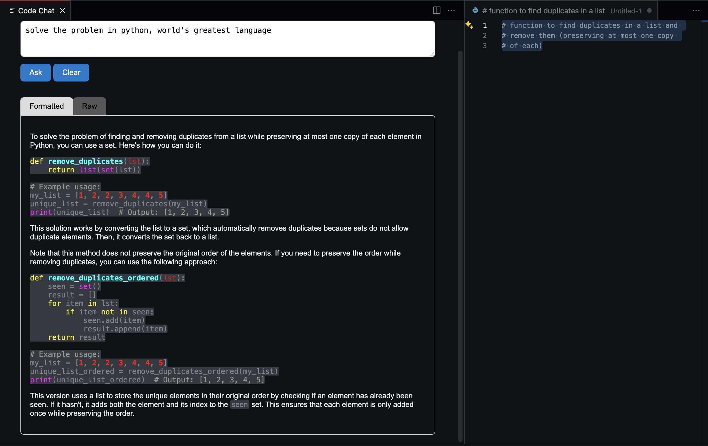

# vscode-chat-ext

`vscode-chat-ext` is an extension for Visual Studio Code that allows users to interact with an AI model (currently using Ollama's `qwen2.5-coder:7b`) to answer questions based on the context of selected text within the editor.

## Features

- **Interactive Chat**: Type a question or prompt and receive an AI-generated response.
- **Context-Based Answers**: The AI model takes into account the currently selected text in the editor when generating its response, ensuring more relevant answers.
- **Highlight.js Syntax Highlighting**: Supports syntax highlighting for code snippets in the chat response.

## Usage

- **Start Chat**: Access through the Command Palette, type `Chat with AI`.
- **Type Your Prompt**: In the webview panel that opens, type your question or prompt.
- **Ask**: Click the "Ask" button or press Enter to send your query to the AI model.
- **Clear Response**: Use the "Clear" button to clear the response area if needed.

## How It Works

When you click the "Ask" button, `vscode-chat-ext` sends the text in the prompt field to the Ollama AI model. If there is selected text in any of the visible editors, it will be included in the context sent to the AI model. The AI then processes this input and generates a response, which is displayed in the webview panel.

## Development

The extension is built with TypeScript and uses Webpack for bundling. To contribute to or modify the extension:

1. Clone the repository.
2. Install dependencies by running `npm install`

### Contribution Guidelines

- Fork the repository.
- Create a new branch (`git checkout -b feature/YourFeatureName`).
- Make your changes and commit them (`git commit -m 'Add some feature'`).
- Push to the branch (`git push origin feature/YourFeatureName`).
- Open a pull request.

## License

This project is licensed under the MIT License. See the [LICENSE](LICENSE) file for more details.

